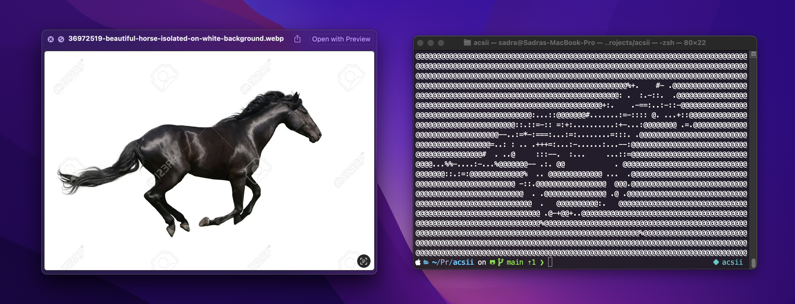
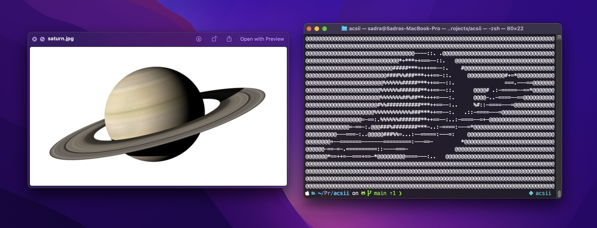

### ACSII - Images to ASCII Arts (2023 - 2nd Semester - AI Class)
> This implementation is based on [Generating ASCII-Art: A Nifty Assignment from a Computer Graphics Programming Course](https://eprints.bournemouth.ac.uk/29537/) paper. [[PDF](https://eprints.bournemouth.ac.uk/29537/1/egEdu17_1.pdf)]

An [Image Processing](https://en.wikipedia.org/wiki/Digital_image_processing) project for turning images into ASCII arts. This project is served as a Python package.

### Installation
Make sure you have [Git](https://git-scm.com/downloads) and [pip](https://pypi.org/project/pip/) installed on your machine then run the following command.
```sh
$ pip install -U git+http://github.com/lnxpy/acsii.git
```

### Usage
```sh
$ acsii --help
usage: acsii [-h] [-o OUTPUT] [-s] [-t {nums,alphs,syms,syms2}] [--version]
             image

ACSII (not ASCII) is an image processing project that is capable of turning real images into ASCII arts.

positional arguments:
  image                 path to image file

options:
  -h, --help            show this help message and exit
  -o OUTPUT, --output OUTPUT
                        output (text) file
  -s, --show-size       show the ASCII image size as well
  -t {nums,alphs,syms,syms2}, --typeset {nums,alphs,syms,syms2}
                        ASCII characters type
  --version             show program's version number and exit

This project is made for learning and college work purposes.
```

### Sample Output Previews




##### Professor
- Vadood Keramati
- Mohammad Yasin Davoodeh (Assistant)

##### Developers/Students
- Ali Reza (Sadra) Yahyapour (Implementation)
- Abolfazl (Kian) Soleymani (R&D)
- Mohammad Amin Esmaeilbeigi (R&D)
